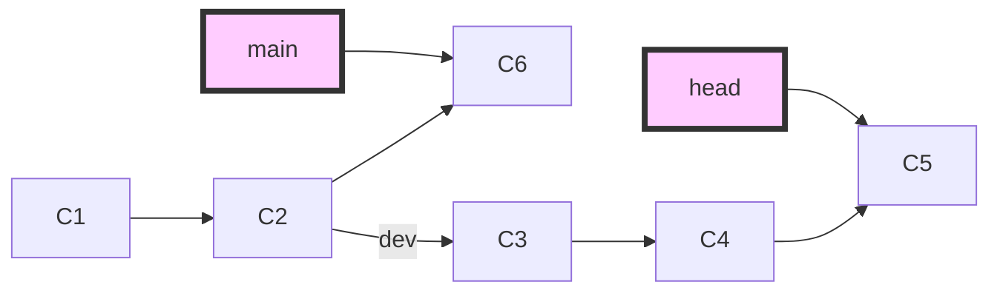
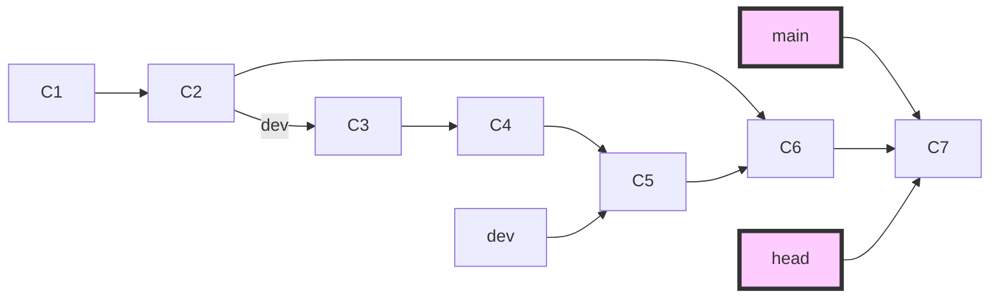
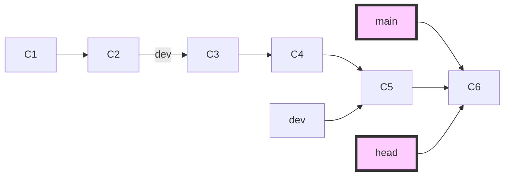

# git 

## git 概念
### git架构
git架构分为几个部分：
* 本地工作区（working directory）
* 暂存区 （stage area）
* 本地仓库（local repository）
* 远程仓库副本 （remote replica )
* 远程仓库 （remote repoository）

### .git的目录结构
* HEAD 当前所在版本库位置
* branchs 分支
* index 存放暂存区（stage area）的相关信息
* object
* refs


## git 常用命令
* git cheetsheet
  https://services.github.com/on-demand/downloads/github-git-cheat-sheet.pdf

* 恢复

  * git checkout

    * 当传入分支名时，可以切换到那个分支。将HEAD移到一个新的分支，然后更新工作目录。

      git checkout 2.0

    * 当传入commitID时，把 HEAD 移动到特定的提交。这对于快速查看项目旧版本来说非常有用。此时HEAD与master分离成为detached HEAD。

      git checkout HEAD~2

      > You are in 'detached HEAD' state. You can look around, make experimental changes and commit them, and you can discard any commits you make in this state without impacting any branches by performing another checkout. If you want to create a new branch to retain commits you create, you may do so (now or later) by using -b with the checkout command again. Example:   git checkout -b <new-branch-name>

    * 文件层面，影响工作区文件。当传入文件时与git reset HEAD --hard功能相似。

      git checkout HEAD readme.MD  git reset HEAD --hard readme.md

  * git revert

    * Revert 撤销一个提交的同时会创建一个新的提交。这是一个安全的方法，因为它不会重写提交历史。相当于一个冲正操作，提交一个逆操作来回归原操作。
    * 只有提交层面，没有文件层面， 回滚提交

  * git reset

    * 撤销
      未执行push， 修改代码还在本地仓库
      1.1 修改的代码未执行add，存在于工作区，撤销执行 git checkout <filename>
      1.2 修改的代码已执行add， 存在于暂存区，测试执行 git reset HEAD <filename>, git checkout <filename>	
    * 回滚
      已执行push， 修改的代码已提交远程仓库


提交层面


| commit level        | head | index | workdir | wd safe |
| ------------------- | ---- | ----- | ------- | ------- |
| reset soft [commit] | REF  | NO    | NO      | YES     |
| reset [commit]      | REF  | YES   | NO      | YES     |
| reset hard [commit] | REF  | YES   | YES     | NO      |
| checkout [commit]   | HEAD | YES   | YES     | YES     |


文件层面

| file level               | head | index | workdir | wd safe |
| ------------------------ | ---- | ----- | ------- | ------- |
| reset  (commit) [file]   | NO   | YES   | NO      | YES     |
| checkout (commit) [file] | NO   | YES   | YES     | NO      |

* 场景1
```
糟了，我刚把不想要的代码，commit到本地仓库中了，但是还没有做push操作！

git reset --hard commit-id

强推到远程
git push origin HEAD --force

```
* 
### 分支管理
* 显示远程分支信息 git ls-remote 
    * git remote -v
    * git remote show origin
* 下载远程分支 git checkout -b 2.0 origin/2.0

* 合并分支
```
git branch
git checkout 2.0
git merge 1.x

//撤销merge
git merge --abort
````
* 从某个commitid开始拉出新分支，并推送到服务端
    * git log : 找到commitid
    *  git checkout commitid -b branchname :基于commitid建立分支
    * git push origin HEAD:remoteName
    
* git merge 与git rebase的区别

    - git merge 操作合并分支会让两个分支的每一次提交都按照提交时间（并不是push时间）排序，并且会将两个分支的最新一次commit点进行合并成一个新的commit，最终的分支树呈现非整条线性直线的形式
- git rebase操作实际上是将当前执行rebase分支的所有基于原分支提交点之后的commit打散成一个一个的patch，并重新生成一个新的commit hash值，再次基于原分支目前最新的commit点上进行提交，并不根据两个分支上实际的每次提交的时间点排序，rebase完成后，切到基分支进行合并另一个分支时也不会生成一个新的commit点，可以保持整个分支树的完美线性
    - git rebase开发流程
  - git clone master branch
      - 在自己本地checkout -b local创建一个本地开发分支
      - 在本地的开发分支上开发和测试
      - 阶段性开发完成后（包含功能代码和单元测试），可以准备提交代码
        - 首先切换到master分支，git pull拉取最新的分支状态
        - 然后切回local分支
        - 通过git rebase -i 将本地的多次提交合并为一个，以简化提交历史。**本地有多个提交时,如果不进行这一步,在git rebase master时会多次解决冲突(最坏情况下,每一个提交都会相应解决一个冲突)**
        - git rebase master 将master最新的分支同步到本地，这个过程可能需要手动解决冲突(**如果进行了上一步的话,只用解决一次冲突**)
        - 然后切换到master分支，git merge将本地的local分支内容合并到master分支
        - git push将master分支的提交上传
      - 本地开发分支可以灵活管理
  
    


​    	git checkout main; git merge dev



git pull(main); git checkout dev; git rebase main;  git checkout main; git merge dev


### ~和^
git log --oneline –graph
~表示纵深位置，^表示横向位置
分支合并，可能出现一个提交有多个父节点时，^用于选择节点
HEAD~ = HEAD^
HEAD~^2表示回退一步，选择合并的节点 


git checkout master 
git merge br1 br2 br3 (C8)
HEAD^ = 4927 HEAD^2 = 063f HEAD^3 = 4f9c